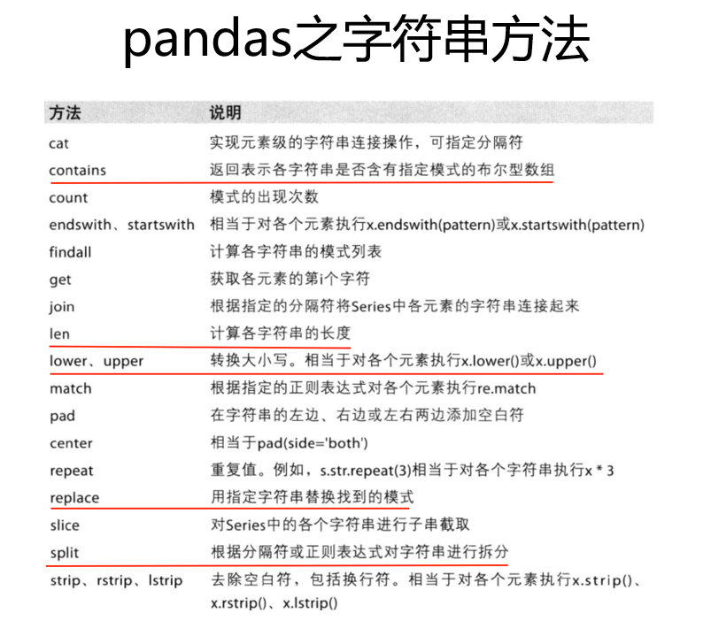

# pandas基础入门

***

## Series--一维，带标签的数组

```python
import pandas as pd

t = pd.Series([1, 2, 3, 12, 14, 31], index=list("abcdef"))

temp_dict = {"name":"LCH", "age":23, "tel":1341234}
t_2 = pd.Series(temp_dict)

# 字典推导式创建一个字典a
a = {string.ascii_uppercase[i]:i for i in range(10)}
pd.Series(a)
# 重新给其指定其他的索引后，如果能对应上，就取其值，如不能就为NaN
pd.Series(a, index=list(string.ascii_uppercase[5:15]))
# dtype: float64
# numpy中nan为float，pandas会自动根据数据类更改series的dtype类型

'''
Series切片和索引
'''
t.index # 获取标签 type : pandas.core.indexes.base.Index
t.values # 获取值 type: numpy.ndarray

temp_dict[1:2]
temp_dict["name"]
t[[2, 3, 6]]
t[t > 4]
```


## 读取外部数据

```python
df = pd.read_csv("name.csv")
df = pd.read_sql(sql_sentence, connection)
```


## DataFrame--二维

```python
pd.DataFrame(np.range(12).reshape(3, 4))

pd.DataFrame(np.range(12).reshape(3, 4), index=list("abc"), columns=list("WXYZ"))

temp_dict = {"name":["LCH", "Lee"], "age":[23, 24], "tel":{1341234, 3244}}
temp_dict = pd.DataFrame(temp_dict)
```

**DataFrame整体情况查询：**

- df.head(3): 显示头部几行，默认5行
- df.tail(3): 显示末尾几行，默认5行
- df.info(): 相关信息概览
- df.describe(): 快速综合统计结果：计数，均值，标准差，最大值，四分位数，最小值

**DataFrame常用函数**

- df.sort_values(by="col name", ascending=False)
  - by: 按指定列排序
  - ascending=Flase: 降序
- df.loc: 通过==标签==索引数据
- df.iloc[1:2, 0:2]: 通过==位置==获取数据
- pd.isnull(df)
- pd.notnull(df)
- df.dropna(axis=0, how="all / any", inplace=True)
  - how=all：全部为nan时在删除当前行(列)，any：有一个就删除
  - inplace=True: 原地修改

- df.fillna(df.mean())
  - df.mean(): 会忽略nan再计算均值; df["index"].mean()
- df["index"].unique(): 返回一个列表 
- df["index"].str.split(",").tolist(): 




## 统计方法和字符串离散化

```python
import numpy as np
from matplotlib import pyplot as plt

runtime_data = np.array([8.1, 7.0, 7.3, 7.2, 6.2, 6.1, ...])
max_runtime = runtime_data.max()
min_runtime = runtime_data.min()
print(min_runtime,max_runtime)

#设置不等宽的组距，hist方法中取到的会是一个左闭右开的去见[1.9,3.5)
num_bin_list = np.array([1.9,3.5])
num_bin_list = np.append(num_bin_list, np.arrange(4.0, max_runtime, 0.5))


#设置图形的大小
plt.figure(figsize=(20,8),dpi=80)
plt.hist(runtime_data,num_bin_list)

#xticks让之前的组距能够对应上
plt.xticks(num_bin_list)

plt.show()
```


## 数据合并分组聚合

```python
'''
一部电影可以有多个分类
统计每一类电影的数量
构造一个全为0的数组，列明为分类，如何某一条数据中分类出现过，就让0变为1
'''
import pandas as pd
from matplotlib import pyplot as plt
import numpy as np
file_path = "./IMDB-Movie-Data.csv"

df = pd.read_csv(file_path)
print(df["Genre"].head(3))
#统计分类的列表
temp_list = df["Genre"].str.split(",").tolist()  #[[],[],[]] list in list

genre_list = list(set([i for j in temp_list for i in j]))

#构造全为0的数组
zeros_df = pd.DataFrame(np.zeros((df.shape[0],len(genre_list))),columns=genre_list)
# print(zeros_df)

#给每个电影出现分类的位置赋值1 
for i in range(df.shape[0]):
    #zeros_df.loc[0,["Sci-fi","Mucical"]] = 1
    zeros_df.loc[i,temp_list[i]] = 1

# print(zeros_df.head(3))

#统计每个分类的电影的数量和
genre_count = zeros_df.sum(axis=0)
print(genre_count)

#排序
genre_count = genre_count.sort_values()
_x = genre_count.index
_y = genre_count.values
#画图
plt.figure(figsize=(20,8),dpi=80)
plt.bar(range(len(_x)),_y,width=0.4,color="orange")
plt.xticks(range(len(_x)),_x)
plt.show()
```

**数据合并**

- df.join(): 默认把行索引相同的数据合并到一起

- df.merge(): 按指定的列把数据按照一定的方式合并到一起

  - how="inner/outer/left/right" inner为内连接， outter外连接， left/right同
  - left_on="" & right_on="" 列索引没有相同的时候，用left_on和right_on指定合并对应的列

- df.groupby(by="columns_name"): grouped是一个DataFrameGroupBy对象，是可迭代的,grouped中的每一个元素是一个元组

  元组里面是（索引(分组的值)，分组之后的DataFrame）

  - grouped.count()/ grouped["index"].count()
  - sum、mean、median、std、var、min、max

**按照多个条件进行分组**

```python
# 以下结果相同，以[["Brand"]]方式可使返回值为DataFrame
grouped1 = df[["Brand"]].groupby(by=[df["Country"],df["State/Province"]]).count()
grouped2= df.groupby(by=[df["Country"],df["State/Province"]])[["Brand"]].count()
grouped3 = df.groupby(by=[df["Country"],df["State/Province"]]).count()[["Brand"]]
```

**数据的索引和复合索引**

- 获取index：df.index

- 指定index ：df.index = ['x','y']

- 重新设置index : df.reindex(list("abcedf"))

- 指定某一列作为index ：df.set_index("Country",drop=False) False表示不将指定的索引列从数据中删掉

- 返回index的唯一值：df.set_index("Country").index.unique()

- 交换复合索引位置：df.swaplevel()
- Series的复合索引取值，直接再括号中写索引即可：df["one", "h"];DataFrame负荷索引取值方式为：df.loc["one"].loc["h"]
